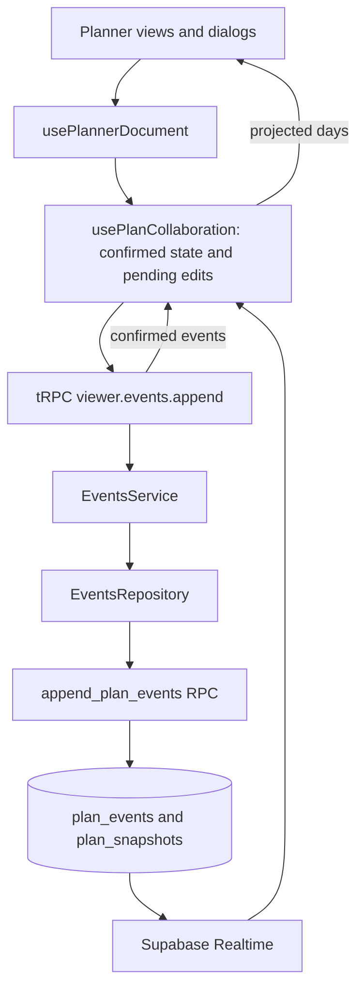

# Architecture

Turistar is a single Next.js App Router application. Routes resolve the viewer and load initial data;
modules compose screens; features own domain behavior and data access. Browser edits use tRPC, while
itinerary synchronization also uses Supabase Realtime.

For installation and commands, see [Contributing](CONTRIBUTING.md).

## Domain model

| Concept | Meaning and storage |
| --- | --- |
| Plan | Trip owner, destination, dates, title, and cover image in `plans`. |
| Day and activity | Ordered itinerary content inside snapshot `state.days`; activities have stable IDs. |
| Event | An itinerary operation stored in `plan_events`, with an event ID and a version scoped to the plan. |
| Snapshot | Itinerary state and the version it represents in `plan_snapshots`. |
| Expense | A separate record in `budget_entries`; activity costs also contribute to displayed totals. |
| Membership | A user's `admin` or `member` tier in `plan_members`. Ownership comes from `plans.user_id`. |
| Profile | Display name, avatar, and unique dashboard slug in `profiles`, associated with an Auth user. |

Snapshots contain days and activities. Budget entries, membership, and profile data have separate read
and write paths. The database also retains `plans.budget`; the current budget view focuses on expenses
and activity costs.

## Code map

| Location | Responsibility |
| --- | --- |
| [`src/app`](src/app) | Pages, layouts, server actions, and HTTP route handlers. |
| [`src/modules`](src/modules/README.md) | Auth, planner, dashboard, layout, and marketing compositions. |
| [`src/features`](src/features/README.md) | Domain types, operations, hooks, services, and repositories. |
| [`src/trpc`](src/trpc/README.md) | API context, validation, procedures, and handlers. |
| [`src/supabase`](src/supabase) | Browser, server, and privileged clients plus generated database types. |
| [`src/ui`](src/ui) | Reusable UI components, styling, and media. |
| [`src/lib`](src/lib) | Shared errors, environment configuration, URLs, and analytics. |
| [`src/i18n`](src/i18n/README.md) | Locale resolution and translation catalogs. |
| [`supabase`](supabase) | Migrations, local configuration, and demo seed data. |

Modules can compose multiple features. Features must not import modules or routes; the corresponding
[Biome rules](biome.json) enforce this direction. Services coordinate domain behavior, and repositories
wrap database queries and RPC calls. Server pages can call services directly; browser business-data
requests use tRPC. Browser authentication uses the Supabase Auth client.

## Loading a plan

1. The [planner page](src/app/%28webapp%29/p/%5BplanId%5D/page.tsx) resolves the viewer and calls
   [`PlanService.getPlannerExperience`](src/features/plan/services/PlanService.ts).
2. The service resolves the UUID or slug, verifies ownership or membership, and loads the snapshot and
   budget entries. An empty snapshot falls back to days built from the plan's date range.
3. [`PlanIdView`](src/modules/planner/planid-view.tsx) receives the initial data and composes the board,
   trip, map, budget, and editing dialogs.
4. [`usePlannerDocument`](src/modules/planner/hooks/usePlannerDocument.ts) connects itinerary actions to
   the collaboration hook, which loads current state and subscribes to new events.

The dashboard uses the same plan service to retrieve the user's trips. Creating a trip calls
`create_full_plan`, which creates plan metadata and an empty snapshot. Optional place details and
Wikidata image lookup supply the cover image.

## Editing an itinerary

An activity edit becomes an explicit operation such as `activity.updated`. The browser assigns an
ID, queues it, and displays the confirmed state with pending operations applied. The server builds
the next snapshot and calls the append RPC with the expected base version. The RPC checks membership,
serializes writes, and stores events and snapshot state in one transaction.

HTTP responses and Realtime messages confirm events through the same ordered path. Version conflicts
or gaps trigger a reload before retrying. Failed writes stay pending so the user can retry or discard
them. Pending changes are held in memory and can be lost on navigation or reload.

These rules apply to itinerary days and activities. Plan metadata, expenses, and members use their own
tRPC procedures and repositories. See [Events](src/features/events/README.md) for ordering, retries,
recovery, and known limits, and [Snapshots](src/features/snapshots/README.md) for the read model.

## Authentication and permissions

- [`proxy.ts`](proxy.ts) refreshes session cookies and sets a Content Security Policy nonce.
- Pages resolve the viewer and enforce route access. The planner service requires ownership or
  membership; unauthenticated planner visits redirect to login.
- Authenticated tRPC procedures verify the viewer. Services, database RPCs, and Row Level Security
  enforce access to the requested resources.
- Owners and admins manage membership; members can edit the itinerary. Adding a member by email
  immediately adds an existing registered user. Plan deletion requires ownership.
- `public_slug` is a URL identifier. Possessing it does not grant access, and anonymous plan reading
  was removed by the [visibility migration](supabase/migrations/20260904213539_remove_is_public_from_plans.sql).

Most database access uses the viewer's Supabase session. Public username availability is a narrow
exception: a server-only helper uses the privileged client and returns a boolean. See
[tRPC](src/trpc/README.md) and the [key protection rule](agents/rules/security-supabase-key-protection.md).

## External services and demo

- **Search:** browser hooks call `/api/places/*`; server handlers call Geoapify. Plan cover lookup can
  also request an image from Wikidata. See [Search](src/features/search/README.md).
- **Maps:** Leaflet renders activities; `/api/tiles/*` proxies CARTO tiles with a server-side key.
- **Analytics:** the optional [PostHog provider](src/lib/analytics/PostHogProvider.tsx) records page views,
  duration, and signed-in account IDs. Configuration is listed in [Contributing](CONTRIBUTING.md#configuration).
- **Demo:** [`src/features/demo`](src/features/demo) signs visitors into a shared account. The seed
  creates curated trips and stores a baseline. On demo dashboard entry, `maybe_reset_demo` restores it
  when at least an hour has elapsed since the last reset. The reset is best-effort on entry, with no
  background scheduler.

## Working with the database

[`supabase/migrations`](supabase/migrations) defines the executable database history, including RPCs
and access policies. [`schema.supabase.sql`](supabase/schema.supabase.sql) is a table reference marked
as context only; it is not an installation script. [`seed.sql`](supabase/seed.sql) supplies local demo
data, and [`src/supabase/types.ts`](src/supabase/types.ts) is generated.

See [Database workflow](CONTRIBUTING.md#database-workflow) for migrations, resets, and type generation.
The optional local `graphify-out` reports help navigate relationships in the code; verify their
commit and inferred relationships against source before relying on them.
