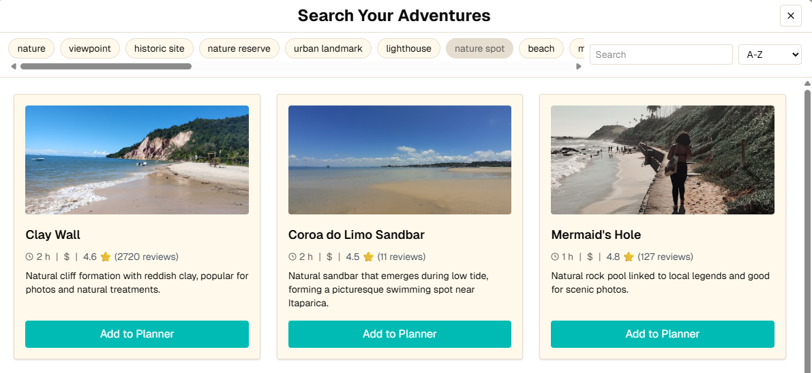

# Turistar – Drag-and-Drop Travel Planner

A simple travel planner built with Next.js, React and drag‑and‑drop. Select any city to generate a starter itinerary that you can rearrange and edit as you like. Plans persist via Supabase so they stick around between visits.

🔗 [Live Demo](https://travel-planner-orpin.vercel.app/)
_or_ deploy easily to Vercel or Netlify with the same settings.

## Table of Contents

- [About the Project](#-about-the-project)
- [Snapshots](#-snapshots-of-the-project)
- [Key Features](#-key-features)
- [Tech Stack](#-tech-stack)
- [Project Structure](#-project-structure)
- [User Flow](#-user-flow)
- [Getting Started](#-getting-started)
- [Scripts](#-scripts)
- [Deployment](#-deployment)
- [Developer Guide](#-developer-guide)
- [What I Focused On](#-what-i-focused-on)
- [License](#-license)

## ✨ About the Project

Turistar is a UX-focused travel planner designed to showcase front-end architecture, state management, and interaction design using modern tools like DnD Kit, Radix UI, and the App Router in Next.js 15.

A new **Map View** lets you preview your itinerary locations on an interactive map.

While editing an activity, you can search the catalog directly from the modal or by right-clicking a card to quickly swap in a new suggestion.

---

## 📷 Snapshots of the project





---

## 🚀 Key Features

- **Welcome Form**
  Enter your trip dates to start a new plan.
- **Planner Board**
  Drag activities between days or add blank cards to build your schedule.
- **Catalog Popup**
  Browse suggested activities and insert them directly into the board.
  - **Search Catalog**
    Quickly filter activities by typing a query.
- **Map View**
  View all your planned attractions on an interactive map.
- **Dynamic Catalog**
  Activities are fetched from Geoapify via `/api/catalog` using your `NEXT_PUBLIC_GEOAPIFY_KEY`.
- **Persistent Storage**
  All planner and budget changes are saved to Supabase so they stay when you refresh.
- **Accessibility & Responsive Design**
  Fully keyboard-accessible with layouts optimised for mobile and desktop.
- **Sample Plan**
  Try the interactive sample itineraries from the home page links.

You can deploy the same app to Vercel or Netlify.

---

## 🏗️ Tech Stack

- **Next.js 15** (App Router)
- **React** & **TypeScript**
- **Tailwind CSS** for styling
- **@dnd-kit/core** & **@dnd-kit/sortable** for drag-and-drop
- **Radix UI** components
- **TanStack Query** for data fetching
- **date-fns** and **react-day-picker** for date handling
- **leaflet** & **react-leaflet** for the map view
- **Vercel** or **Netlify** for hosting

---

## 📁 Project Structure

- `/docs`: Project notes and guidelines (see [STATE-DATA-FLOW.md](docs/STATE-DATA-FLOW.md) for how data moves)
- `/public`: Static assets served directly
- `/src`: Source code to be analyzed and maintained by AI agents
  - `/app`: Next.js app directory with pages and API routes
  - `/features`: Feature modules such as home, planner, budget and onboarding
  - `/shared`: Shared UI components, hooks, utilities and types
  - `/server`: Server actions and API handlers
  - `/data`: Local JSON used for demo itineraries

```ts
import { PlannerControls } from '@/features/planner';
```

See [Routing](docs/ROUTING.md) for a breakdown of the `src/app` directory.

---

## 🧭 User Flow

1. Start by selecting your trip dates
2. Choose destination categories and search the catalog
3. Browse results or use the **Back** button to refine your filters
4. Drag cards into the planner board by day
5. Click cards to edit title, image, or move between days
6. All planner and budget data persist automatically in Supabase

---

## 💻 Getting Started

**Prerequisites**: Node.js v18+, npm

1. **Clone the repo**

   ```bash
   git clone https://github.com/andre-lmarinho/travel-planner.git
   cd travel-planner
   ```

2. **Install dependencies**

   ```bash
   npm install
   # or
   yarn
   # or
   pnpm install
   ```

3. **Run the development server**

   ```bash
   npm run dev
   # or
   yarn dev
   # or
   pnpm dev
   ```

   Open [http://localhost:3000](http://localhost:3000) in your browser.

4. **Configure environment**
 - Copy `.env.example` to `.env.local`.
 - Set the following variables (validated in [`env.ts`](src/shared/lib/env.ts) and [`clientEnv.ts`](src/shared/lib/clientEnv.ts)):
    - `NEXT_PUBLIC_GEOAPIFY_KEY`
    - `NEXT_PUBLIC_SUPABASE_URL`
    - `NEXT_PUBLIC_SUPABASE_ANON_KEY`
  - Optionally set `SUPABASE_SERVICE_ROLE_KEY` for local type generation.
  - See [Environment](docs/ENVIRONMENT.md) for validation details and authentication flow.
  - In Vercel, add the same values in **Project Settings → Environment Variables**.
   - In Supabase, copy the URL and keys from your project dashboard.
   - Start a local Supabase instance with `supabase start`.
   - Generate database types with `npm run gen:types` whenever the schema changes.

### Development Workflow

1. Install dependencies with `npm install`.
2. Start the dev server using `npm run dev`.
3. Format code before committing with `npm run format`.
4. Run the linter via `npm run lint`.
5. Run the type checker with `npm run typecheck`.
6. Ensure all tests pass with `npm run test`.
7. Follow the commit message style: start with an appropriate Gitmoji followed by a short, capitalized description in English (see [commit message examples](docs/CONTRIBUTING.md#sample-commit-messages)). Commitlint enforces this format.

---

## 📦 Scripts

- `npm run dev` — start development server
- `npm run build` — compile for production
- `npm run start` — run production build locally
- `npm run lint` — run ESLint
- `npm run format` — run Prettier
- `npm run test` — run unit tests
- `npm run test:watch` — run tests in watch mode

### Local Vercel build

```bash
npm run vercel:pull
npm run vercel:build
```

## 🧪 Testing

See [docs/TESTING.md](docs/TESTING.md) for details on the Vitest setup and testing approach.

---

## ☁️ Deployment

Deploy easily to **Vercel** or **Netlify**:

1. Push your code to GitHub.
2. Import the repository in your hosting service (https://vercel.com/new or https://app.netlify.com/start).
3. Add the required environment variables:
   - `NEXT_PUBLIC_GEOAPIFY_KEY`
   - `NEXT_PUBLIC_SUPABASE_URL`
   - `NEXT_PUBLIC_SUPABASE_ANON_KEY`
4. Click "Deploy" — the platform will build and preview automatically.

_For detailed guides, see:_

- Next.js Deployment Docs: https://nextjs.org/docs/app/building-your-application/deploying
- Vercel Docs: https://vercel.com/docs
- Netlify Docs: https://docs.netlify.com/

---

## 🧠 What I Focused On

- Feature-based architecture with shared utilities and typed APIs
- Clean and maintainable drag‑and‑drop logic using `@dnd-kit`
- Custom components built on top of Radix UI primitives
- Remote persistence using Supabase for planner and budget
- UX patterns: inline editing, optimistic updates, responsive layout and accessible components
- Progressive structure ready to scale with real APIs

---

## 🛠️ Developer Guide

For more details on project conventions, see:

- [Project Overview](docs/OVERVIEW.md)
- [Architecture Overview](docs/ARCHITECTURE.md)
- [Database Schema](docs/DATABASE.md)
- [State Data Flow](docs/STATE-DATA-FLOW.md)
- [Environment](docs/ENVIRONMENT.md)
- [Routing](docs/ROUTING.md)
- [Home Feature](docs/features/home.md)
- [Planner Feature](docs/features/planner.md)
- [Budget Feature](docs/features/budget.md)
- [Onboarding Feature](docs/features/onboarding.md)
- [Style Guide](docs/STYLE-GUIDE.md)
- [Accessibility](docs/ACCESSIBILITY.md)
- [Testing](docs/TESTING.md)
- [Deployment](docs/DEPLOYMENT.md)
- [Commenting Standards](docs/COMMENTING.md)
- [Contributing](docs/CONTRIBUTING.md)

---

## 📜 License

This project is open-source under the [MIT License](LICENSE).
Feel free to reuse and adapt!

---

Built with 💙 by André Marinho  
Feel free to ⭐ this repo if you find it useful!
