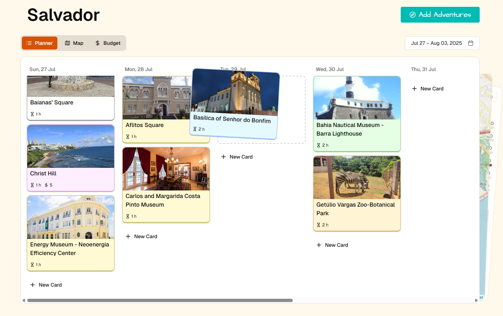

# Turistar

Plan trips together with a visual itinerary, an interactive map, and shared expenses.

Turistar is an open-source travel planner. Organize activities by day, move them with drag and drop,
find places, and plan with other registered users. Plans are accessible to their owner and members.

[Open Turistar](https://turistar.me) · [Architecture](ARCHITECTURE.md) · [Contributing](CONTRIBUTING.md)



## Features

- **Itineraries:** arrange activities in board and trip views, with changes synchronized between editors.
- **Places and maps:** search destinations and activities, then see stops on an interactive map.
- **Expenses:** track activity costs and additional expenses by category.
- **Collaboration:** add existing users by email and manage admin or member access.
- **Demo:** explore seeded trips through a shared demo account whose changes are periodically reset on entry.
- **Languages:** English and Brazilian Portuguese.

## Run locally

Install Node.js from [`.nvmrc`](.nvmrc), pnpm from [`package.json`](package.json), the
[Supabase CLI](https://supabase.com/docs/guides/local-development), and a Docker-compatible container
runtime. Start the container runtime before continuing.

```sh
git clone https://github.com/andre-lmarinho/turistar.git
cd turistar
pnpm install
cp .env.example .env.local
supabase start
```

Fill in `.env.local` using the [configuration guide](CONTRIBUTING.md#configuration). The local
service-role key supports username availability checks; Geoapify enables search and CARTO enables map
tiles. Keep secrets in `.env.local`.

```sh
pnpm dev
```

Open [http://127.0.0.1:3000](http://127.0.0.1:3000), matching the local Auth configuration. `pnpm dev`
starts or reuses Supabase, applies pending migrations, and starts Next.js. For setup details and common
issues, see [Local development](CONTRIBUTING.md#local-development).

## Understand the project

Turistar is a single Next.js App Router application using React, TypeScript, Tailwind CSS, tRPC,
TanStack Query, and Supabase Auth/PostgreSQL/Realtime. See [`package.json`](package.json) for versions.

| Start here | What it explains |
| --- | --- |
| [Architecture](ARCHITECTURE.md) | Domain concepts, data flows, persistence, and access control. |
| [Feature index](src/features/README.md) | Product capabilities and their code entry points. |
| [Modules](src/modules/README.md) | Page composition and interactive views. |
| [tRPC](src/trpc/README.md) | API context, routers, and procedures. |
| [Internationalization](src/i18n/README.md) | Locale selection and translations. |
| [Contributing](CONTRIBUTING.md) | Setup, checks, database workflow, and deployment. |
| [Agent instructions](AGENTS.md) | Constraints and workflow for coding agents. |

## Contribute

Run `pnpm lint`, `pnpm typecheck:ci`, and the relevant tests before submitting a change. See
[Checks](CONTRIBUTING.md#checks) for focused test commands and [Pull requests](CONTRIBUTING.md#pull-requests)
for review expectations. Report bugs and propose changes through
[GitHub issues](https://github.com/andre-lmarinho/turistar/issues).

## License

[GNU Affero General Public License v3.0](LICENSE). Maintained by [André Marinho](https://andremarinho.me/).
